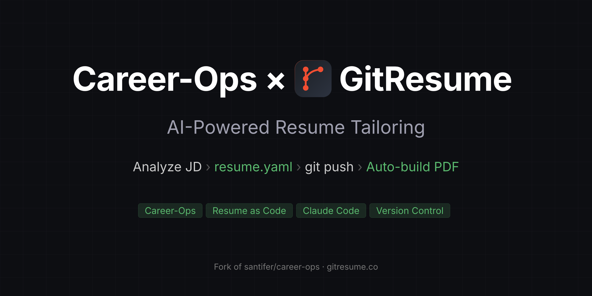

# Career-Ops × GitResume

<p align="center">
  
</p>

<p align="center">
  <em>AI-powered job search with version-controlled resumes.</em><br>
  Career-Ops analyzes and tailors. <strong>GitResume builds and versions.</strong><br>
  <em>Every job application becomes a trackable commit.</em>
</p>

<p align="center">
  
  
  
  <a href="https://gitresume.co"></a>
</p>

---

## What Is This

This is a [GitResume](https://gitresume.co) fork of [santifer/career-ops](https://github.com/santifer/career-ops) — an open-source AI job search system built on Claude Code.

**What changed:** Instead of generating local PDFs via Playwright, the `pdf` mode outputs a `resume.yaml` in GitResume format and pushes it to your GitHub repo. GitResume auto-builds a professional PDF with version control and a shareable link.

```
Analyze JD › resume.yaml › git push › Auto-build PDF
```

**What stayed the same:** Everything else — the A-F evaluation system, portal scanner, batch processing, interview prep, and application tracker.

## Why This Fork

The original Career-Ops is great at tailoring resumes. But every tailored resume is just a local file — no history, no way to compare, no way to learn from past applications.

With GitResume:
- Every application gets its own **branch** (`apply/company-name`)
- Every change is a **commit** you can diff
- Every push **auto-builds** a PDF you can download
- Your public resume (`main`) stays untouched

## Quick Start

```bash
git clone https://github.com/gitresume-co/career-ops.git
cd career-ops
npm install
npx playwright install chromium   # For offer verification
claude
```

Claude Code will start onboarding. Follow the steps to set up your CV and profile.

### Set up GitResume

During onboarding or anytime with `/career-ops gitresume`:

- **Already have a GitResume repo?** Tell the AI your repo name.
- **Don't have one?** The AI walks you through creating one from [resume-template](https://github.com/gitresume-co/resume-template/generate) and connecting it at [gitresume.co/start](https://gitresume.co/start).

### Usage

Paste a job URL or use commands:

```
/career-ops gitresume  → Set up GitResume integration
/career-ops {paste JD} → Full pipeline: evaluate + resume.yaml + push + tracker
/career-ops scan       → Scan portals for new offers
/career-ops pdf        → Generate tailored resume.yaml (→ GitResume auto-builds PDF)
/career-ops batch      → Batch evaluate multiple offers
/career-ops tracker    → View application status
/career-ops apply      → Fill application forms with AI
/career-ops deep       → Deep company research
```

## How It Works

```
You paste a job URL
        │
        ▼
┌──────────────────┐
│  Archetype       │  Classifies role type and adapts framing
│  Detection       │
└────────┬─────────┘
         │
┌────────▼─────────┐
│  A-F Evaluation  │  Match, gaps, comp research, STAR stories
│  (reads cv.md)   │
└────────┬─────────┘
         │
    ┌────┼────┐
    ▼    ▼    ▼
 Report  YAML  Tracker
  .md   push    .tsv
         │
         ▼
    GitResume
   auto-builds
      PDF
```

## Features

| Feature | Description |
|---------|-------------|
| **GitResume Integration** | Tailored resumes pushed as branches, auto-built PDFs, version control |
| **Auto-Pipeline** | Paste a URL, get evaluation + resume.yaml + push + tracker entry |
| **A-F Evaluation** | 10 weighted dimensions across 6 blocks |
| **Interview Story Bank** | Accumulates STAR+R stories across evaluations |
| **Portal Scanner** | 45+ companies pre-configured |
| **Batch Processing** | Parallel evaluation with `claude -p` workers |
| **Dashboard TUI** | Terminal UI to browse and filter your pipeline |
| **Pipeline Integrity** | Automated merge, dedup, status normalization |

## Credits

Forked from [santifer/career-ops](https://github.com/santifer/career-ops) by [Santiago](https://santifer.io), who used the original to evaluate 740+ job listings and land a Head of Applied AI role.

## License

MIT — see [LICENSE](LICENSE)
